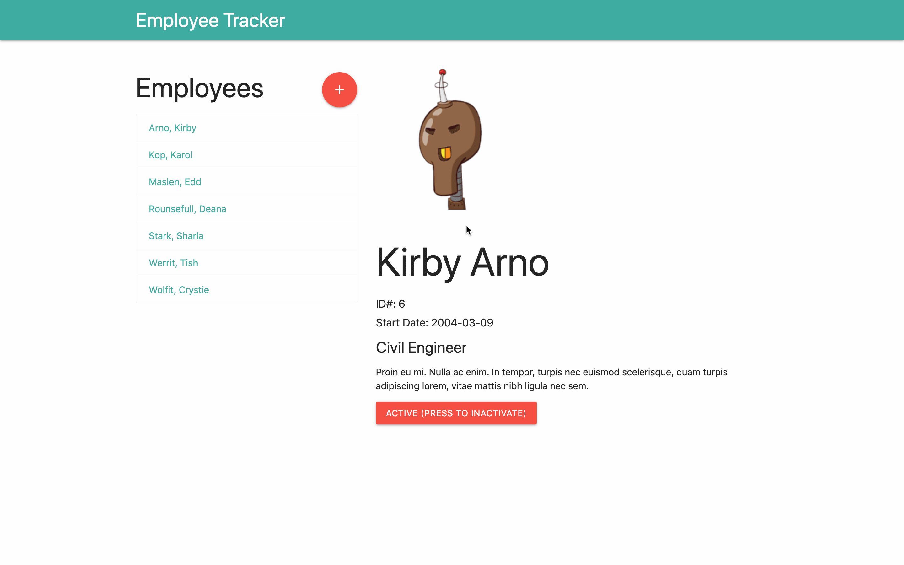
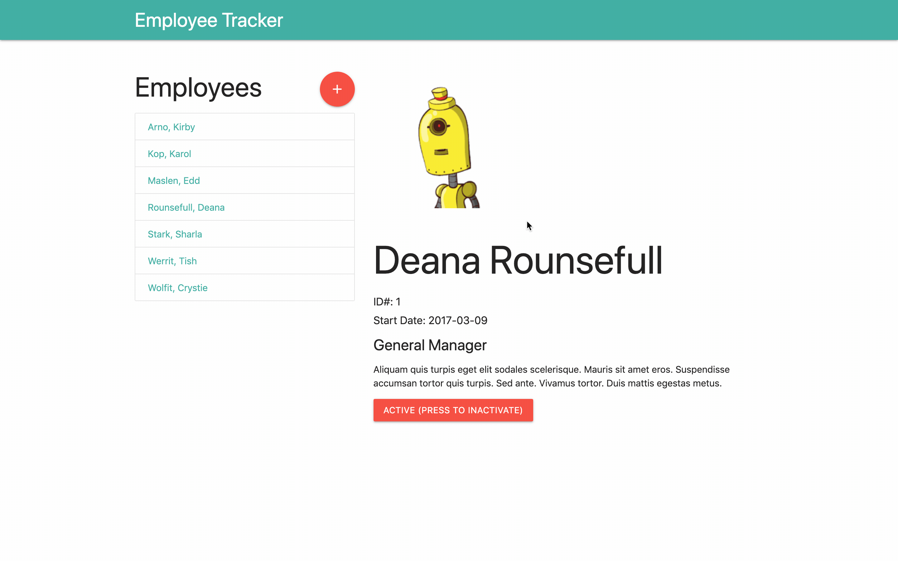

# Employee Tracker Lab
You've been hired as a frontend developer for a startup company. They would like you to build the frontend of a single-page app (SPA) to help them keep track of their employees.

# Setup
Run `json-server db.json --watch --port 3003` to run your backend server on port 3003 (feel free to change your chosen port).

# Deliverables

### A. Viewing All Employees
1. On page load, show the list of employees by **full name** in the `employee-list` ul. It should look like `LastName, FirstName`.
2. When an employee name is clicked, all of their info should be shown in the `employee-info` div (Show Page). This includes:
    - Their avatar
    - Their full name
    - Their job title
    - Their active status

Be sure to look over the data structure in the json file.

### B. Adding New Employees

Nice work! Your manager is impressed. The company is growing. You're now tasked with adding the ability to add newly-hired employees to the Employee Tracker.

3. When I click the `+` button, the contents of the `employee-info` div changes to a form.
4. Submission of this form adds the new employee to the database. (Note: All new employees' active status is set to `true`.)
5. After the employee is successfully added to the database, their name is added to the sidebar.
6. Also after successful submission, the form in the `employee-info` div is replaced with the new employee's info (Show Page).

### C. Updating Employee Status

Great Work! Unfortunately, the company isn't doing so well and needs to layoff a few individuals. They don't want them deleted from the database completely though. Your final task is to allow the app to toggle active status.

7. Add a button to the employee show page that, when clicked, allows their active status to toggle between true and false.
8. The user should see the active status changing on click without having to refresh or click around, and the data should persist.

### BONUS
You're bored one day and decide you want to spice up the app. Maybe try implementing some of the below?

9. Currently, the names in the sidebar aren't in order. Try ordering them by last name.
10. There is extra info in the database (job description and start date). Try displaying them on the show page and including them in the new employee form.
11. This app uses the Materialize CSS framework. Maybe you could incorporate some of its elements to make the app more visually appealing?

# Fin
You've done amazing work. Unfortunately, the company is filing for bankruptcy. You won't lose what you've learned here though. Onto your next endeavor!
